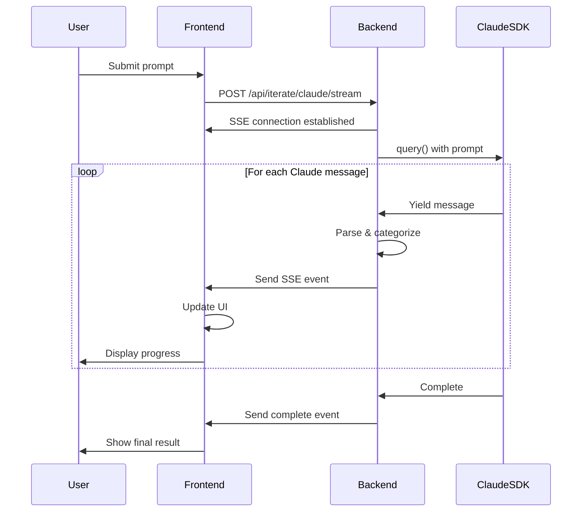

# Product Requirements Document: Claude Code Streaming Integration

## Executive Summary

Enable real-time streaming of Claude Code SDK operations to the frontend, providing users with visibility into AI code generation steps as they happen. This feature will transform the current synchronous Claude integration into a transparent, interactive experience where users can observe file reads, edits, and other operations in real-time.

## Problem Statement

Currently, when users interact with Claude Code in the LOL application:
- The entire generation process is opaque - users see a loading spinner with no insight into what's happening
- Operations can take 30-60+ seconds with no feedback
- Users cannot understand what files Claude is reading or modifying
- Debugging issues is difficult without visibility into the AI's decision-making process

## Goals

### Primary Goals
1. **Transparency**: Show users exactly what Claude is doing at each step
2. **Engagement**: Keep users informed during long-running operations
3. **Trust**: Build confidence by showing the AI's working process
4. **Debugging**: Help users understand and troubleshoot generation issues

### Success Metrics
- Reduced user abandonment during generation (target: -30%)
- Increased user satisfaction scores for AI interactions
- Decreased support tickets related to "stuck" generations
- Improved iteration success rate through better user understanding

## User Stories

### As a developer using LOL:
1. I want to see what files Claude is reading so I understand the context it's using
2. I want to see when Claude is writing/editing files so I know what's being changed
3. I want to see Claude's reasoning as it works through my request
4. I want to know if something goes wrong and where the process failed
5. I want the option to use streaming or non-streaming mode based on my preference

## Technical Requirements

### Backend Requirements

#### 1. New Streaming Endpoint
- **Path**: `/api/iterate/claude/stream`
- **Method**: POST
- **Request Body**: 
  ```typescript
  {
    projectId: string;
    prompt: string;
  }
  ```
- **Response**: Server-Sent Events (SSE) stream
- **Event Format**:
  ```typescript
  {
    type: 'assistant' | 'tool_use' | 'tool_result' | 'complete' | 'error';
    data: {
      content?: string;
      tool?: string;
      toolInput?: any;
      toolOutput?: any;
      files?: Record<string, { content: string; type: string }>;
      error?: string;
    };
    timestamp: number;
  }
  ```

#### 2. ClaudeWorkspace Service Enhancement
- Add `generateStream()` method that yields messages as AsyncGenerator
- Preserve existing `generate()` method for backward compatibility
- Parse and categorize Claude SDK messages:
  - Assistant responses
  - Tool usage (Read, Write, Edit operations)
  - Tool results
  - Completion status

#### 3. SSE Implementation Details
- Use Fastify's built-in SSE support
- Implement proper connection handling and cleanup
- Add heartbeat events every 30 seconds to keep connection alive
- Handle client disconnections gracefully
- Set appropriate CORS headers for SSE

### Frontend Requirements

#### 1. Streaming Configuration
- Add streaming toggle in UI next to existing Claude Code toggle
- Store streaming preference in localStorage
- Default to streaming enabled for new users

#### 2. EventSource Integration
- Create React hook `useClaudeStream` for managing SSE connection
- Handle reconnection logic with exponential backoff
- Parse and dispatch streaming events to UI components
- Clean up connections on component unmount

#### 3. UI Components

##### Streaming Status Display
```typescript
interface StreamingStatus {
  isStreaming: boolean;
  currentAction?: {
    type: 'reading' | 'writing' | 'thinking' | 'complete';
    target?: string; // filename or description
    progress?: number; // optional progress percentage
  };
  messages: StreamMessage[];
}
```

##### Message Types Display
- **Reading File**: "📖 Reading index.html..."
- **Writing File**: "✏️ Updating style.css..."
- **Thinking**: "🤔 Analyzing code structure..."
- **Tool Use**: "🔧 Using [tool name]..."
- **Complete**: "✅ Generation complete!"
- **Error**: "❌ Error: [error message]"

#### 4. AIChat Component Updates
- Add streaming message container above input
- Show real-time updates with smooth animations
- Collapse completed steps optionally
- Maintain full conversation history
- Add "Show Details" toggle for verbose output

### Data Flow



## Implementation Phases

### Phase 1: Backend Streaming (Week 1)
- [ ] Create `/api/iterate/claude/stream` endpoint
- [ ] Implement SSE in Fastify
- [ ] Add `generateStream()` to ClaudeWorkspace
- [ ] Test streaming with curl/Postman

### Phase 2: Frontend Integration (Week 2)
- [ ] Create `useClaudeStream` hook
- [ ] Add streaming toggle to UI
- [ ] Implement basic message display
- [ ] Handle connection lifecycle

### Phase 3: Enhanced UX (Week 3)
- [ ] Add animations and transitions
- [ ] Implement progress indicators
- [ ] Add message filtering/collapsing
- [ ] Create detailed/compact view modes

### Phase 4: Polish & Testing (Week 4)
- [ ] Error handling and recovery
- [ ] Performance optimization
- [ ] Cross-browser testing
- [ ] Documentation

## Non-Functional Requirements

### Performance
- First byte time < 500ms after request
- Message latency < 100ms from SDK to UI
- Support concurrent streaming sessions
- Graceful degradation under load

### Reliability
- Automatic reconnection on network issues
- Fallback to non-streaming mode on failure
- No data loss during streaming
- Proper cleanup of resources

### Security
- Validate all streamed content
- Sanitize HTML in messages
- Rate limiting on streaming endpoints
- Authentication/authorization preserved

### Accessibility
- Screen reader support for streaming updates
- Keyboard navigation for message history
- High contrast mode support
- Reduced motion options

## Risks and Mitigations

| Risk | Impact | Probability | Mitigation |
|------|--------|-------------|------------|
| SSE connection drops | High | Medium | Implement auto-reconnect with backoff |
| Browser incompatibility | Medium | Low | Provide WebSocket fallback |
| Information overload | Medium | Medium | Add filtering and compact modes |
| Performance degradation | High | Low | Implement message batching and throttling |
| Claude SDK changes | High | Low | Abstract SDK interface, version lock |

## Future Enhancements

1. **Streaming to Multiple Clients**: Allow multiple users to watch the same generation
2. **Replay Mode**: Record and replay generation sessions
3. **Intervention**: Allow users to pause/modify generation mid-stream
4. **Analytics**: Track which steps take longest, failure points
5. **WebSocket Upgrade**: Move from SSE to WebSockets for bidirectional communication
6. **Streaming for Other AI Providers**: Extend to OpenAI, Groq integrations

## Success Criteria

The feature will be considered successful when:
1. 80% of users keep streaming enabled after trying it
2. Average user engagement during generation increases by 50%
3. Support tickets about "stuck" generations decrease by 40%
4. User satisfaction scores for AI features improve by 20%

## Dependencies

- Claude Code SDK v1.0.112+ (already installed)
- Fastify with SSE support (may need plugin)
- Modern browser with EventSource API support
- Existing project structure and database schema

## Timeline

- **Total Duration**: 4 weeks
- **Launch Date**: End of Month
- **Beta Testing**: Week 3-4
- **Full Rollout**: After beta feedback incorporation

## Appendix

### Example Streaming Messages

```json
// Reading a file
{
  "type": "tool_use",
  "data": {
    "tool": "Read",
    "toolInput": { "file_path": "/tmp/claude-123/index.html" }
  },
  "timestamp": 1703001234567
}

// Assistant thinking
{
  "type": "assistant",
  "data": {
    "content": "I'll update the CSS to fix the layout issue..."
  },
  "timestamp": 1703001235567
}

// Writing a file
{
  "type": "tool_use",
  "data": {
    "tool": "Write",
    "toolInput": { 
      "file_path": "/tmp/claude-123/style.css",
      "content": "/* Updated styles */\n..."
    }
  },
  "timestamp": 1703001236567
}

// Completion
{
  "type": "complete",
  "data": {
    "files": {
      "index.html": { "content": "...", "type": "html" },
      "style.css": { "content": "...", "type": "css" },
      "script.js": { "content": "...", "type": "javascript" }
    }
  },
  "timestamp": 1703001240567
}
```

### API Documentation Template

```yaml
openapi: 3.0.0
paths:
  /api/iterate/claude/stream:
    post:
      summary: Stream Claude Code generation steps
      tags: [ai, streaming]
      requestBody:
        required: true
        content:
          application/json:
            schema:
              type: object
              properties:
                projectId:
                  type: string
                  format: uuid
                prompt:
                  type: string
                  maxLength: 5000
      responses:
        '200':
          description: SSE stream of generation steps
          content:
            text/event-stream:
              schema:
                type: string
                format: SSE
```